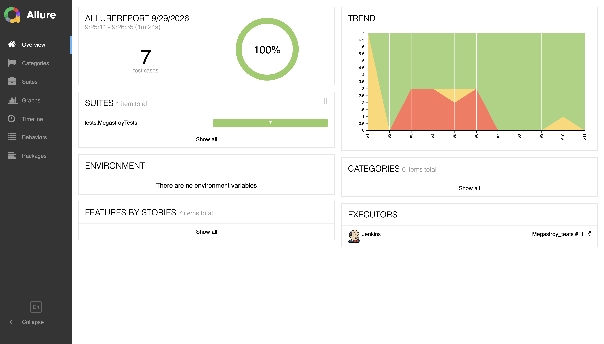
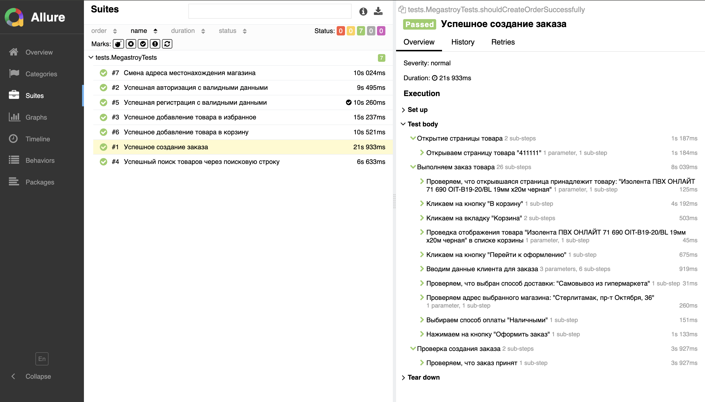
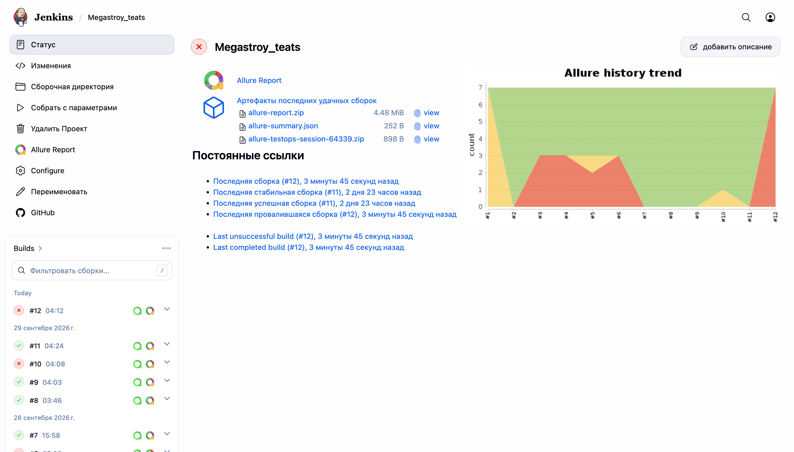
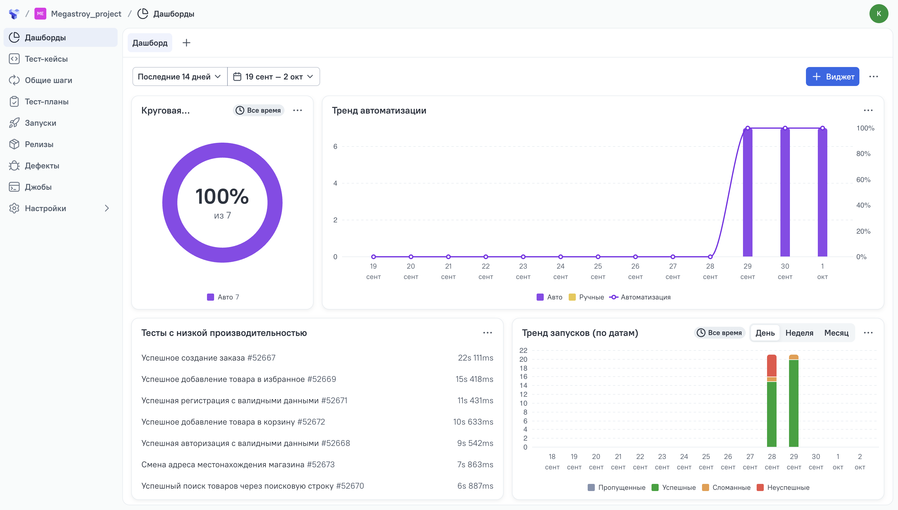
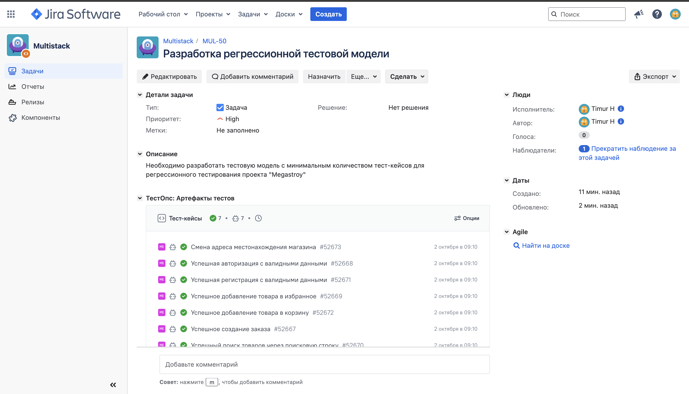

<div align="center">
  

  <h1>Проект по автоматизации тестирования сайта <font color="#B22222">megastroy.com</font></h1>

  <p>Автоматизированные UI-тесты интернет-магазина строительных материалов</p>

  <p>
    🔗 <a href="https://megastroy.com" target="_blank">Перейти на сайт megastroy.com</a>
  </p>
</div>

---

## 📑 Содержание

- [О проекте](#-о-проекте)
- [Использованный стек технологий](#-использованный-стек-технологий)
- [Архитектура и подход к автоматизации](#-архитектура-и-подход-к-автоматизации)
- [Тестовое покрытие](#-тестовое-покрытие)
- [Структура проекта](#-структура-проекта)
- [Запуск тестов](#-запуск-тестов)
- [Параметры запуска](#-параметры-запуска)
- [Allure Report](#-allure-report)
- [Selenoid и видеозапись](#-selenoid-и-видеозапись)
- [Jenkins](#-jenkins)
- [Allure TestOps](#-allure-testops)
- [Jira](#-jira)
- [Рекомендации по работе с тестовыми данными](#-рекомендации-по-работе-с-тестовыми-данными)
- [Roadmap](#-roadmap)
- [Об авторе](#-об-авторе)

---

## 🔍 О проекте

Проект представляет собой UI-фреймворк для автоматизации функциональных сценариев интернет-магазина строительных материалов **Megastroy**.

Цель проекта — автоматизировать ключевые пользовательские сценарии и продемонстрировать практическое применение современных подходов к UI-тестированию: Page Object, Component Object, Fluent Interface, Allure и удалённый запуск браузера в Selenoid.

### Автоматизированные пользовательские сценарии

- регистрация нового пользователя;
- авторизация существующего пользователя;
- поиск товара через поисковую строку;
- добавление товара в корзину;
- создание заказа с самовывозом и оплатой наличными;
- смена выбранного магазина;
- добавление товара в избранное.

На текущем этапе реализовано **7 UI-тестов**.

---

## 💻 Использованный стек технологий

<p align="center">
  <a href="https://www.oracle.com/java/"></a>
  <a href="https://gradle.org/"></a>
  <a href="https://junit.org/junit5/"></a>
  <a href="https://selenide.org/"></a>
  <a href="https://www.jenkins.io/"></a>
  <a href="https://aerokube.com/selenoid/latest/">
  <a href="https://allurereport.org/"></a>
  <a href="https://www.atlassian.com/software/jira"></a>
  <a href="https://allurereport.org/allure-testops/"></a>
</p>

| Категория | Технология |
|---|---|
| Язык программирования | Java 17 |
| Сборщик | Gradle 8.14.5 |
| UI automation | Selenide 7.16.2 |
| Тестовый фреймворк | JUnit 5.9.3 |
| Отчётность | Allure Report 2.32.0 |
| Удалённый запуск браузера | Selenoid |
| Генерация тестовых данных | JavaFaker 1.0.2 |
| Архитектурный подход | Page Object + Component Object + Fluent Interface |

---

## 🏗 Архитектура и подход к автоматизации

### 1. Page Object

Для каждой ключевой страницы сайта создан отдельный класс, который инкапсулирует локаторы и действия пользователя.

Примеры:

```text
MainPage
LoginPage
RegistrationPage
ProductItemPage
BasketPage
OrderPage
FavoritePage
```

Тест содержит бизнес-шаги, а детали взаимодействия с UI находятся внутри Page Object.

### 2. Component Object

Повторно используемые элементы вынесены в отдельные компоненты:

```text
PopupComponent
SearchBarComponent
UserFormComponent
```

Это позволяет не дублировать одинаковую логику между страницами и упрощает дальнейшее развитие проекта.

### 3. Fluent Interface

Методы Page Object возвращают текущую страницу или следующую страницу, поэтому сценарии читаются как последовательность действий пользователя:

```java
productItem
        .openProductItemPage(testData.FIRST_PRODUCT_NUMBER_ITEM)
        .checkNameProductItem(testData.FIRST_PRODUCT_ITEM_NAME)
        .clickAddInBasket()
        .openBasket()
        .checkAddedBasketItem(testData.FIRST_PRODUCT_ITEM_NAME);
```

### 4. Allure + Selenide

Каждый тест запускается с интеграцией `AllureSelenide`, а после завершения теста автоматически собираются артефакты:

- скриншот;
- исходный код страницы (Page Source);
- логи браузерной консоли;
- ссылка на видео прогона в Selenoid.

### 5. Работа с нестабильными popup-окнами

Для автоматического удаления внешних popup-элементов используется `PopupHelper`, который запускает отдельный daemon-поток и периодически пытается закрывать popup-элементы Mindbox / PopMechanic.

---

## 🧪 Тестовое покрытие

| № | Сценарий | Проверяемая функциональность | Тип |
|---:|---|---|---|
| 1 | Успешная регистрация | Заполнение регистрационной формы и проверка профиля | Positive |
| 2 | Успешная авторизация | Вход существующего пользователя и проверка профиля | Positive |
| 3 | Поиск товара | Поиск товара через поисковую строку | Positive |
| 4 | Добавление в корзину | Добавление товара и проверка корзины | Positive |
| 5 | Создание заказа | Корзина → оформление → самовывоз → оплата → подтверждение | E2E / Positive |
| 6 | Смена магазина | Выбор города и магазина | Positive |
| 7 | Добавление в избранное | Добавление товара и проверка списка избранного | Positive |

### Основные E2E-цепочки

**Покупка товара:**

```text
Открытие товара
      ↓
Проверка названия
      ↓
Добавление в корзину
      ↓
Переход в корзину
      ↓
Проверка товара
      ↓
Оформление заказа
      ↓
Заполнение данных покупателя
      ↓
Выбор самовывоза
      ↓
Проверка магазина
      ↓
Выбор оплаты
      ↓
Подтверждение заказа
```

**Авторизация:**

```text
Страница авторизации
      ↓
Email + пароль
      ↓
Запомнить пользователя
      ↓
Вход
      ↓
Проверка имени и email в профиле
```

---

## 📂 Структура проекта

```text
Megastroy/
├── gradle/
│   └── wrapper/                     # Gradle Wrapper
├── src/
│   └── test/
│       ├── java/
│       │   ├── helpers/             # Вспомогательные классы
│       │   │   ├── Attach           # Аттачи для Allure
│       │   │   └── PopupHelper      # Работа со всплывающими окнами
│       │   │
│       │   ├── pages/               # Page Objects
│       │   │   ├── components/      # Переиспользуемые UI-компоненты
│       │   │   │   ├── PopupComponent
│       │   │   │   ├── SearchBarComponent
│       │   │   │   └── UserFormComponent
│       │   │   ├── BasketPage
│       │   │   ├── FavoritePage
│       │   │   ├── LoginPage
│       │   │   ├── MainPage
│       │   │   ├── OrderPage
│       │   │   ├── OrderSuccessPage
│       │   │   ├── ProductItemPage
│       │   │   ├── RegistrationPage
│       │   │   ├── SearchResultPage
│       │   │   └── ShopSelectionPage
│       │   │
│       │   ├── testData/            # Конфигурация и тестовые данные
│       │   │   ├── ConfigData
│       │   │   └── TestData
│       │   │
│       │   └── tests/               # Тестовые классы
│       │       ├── MegastroyTests
│       │       └── TestBase
│       │
│       └── resources/
│           └── images.png           # Логотип проекта
│
├── build.gradle                     # Конфигурация Gradle
├── settings.gradle                  # Настройки Gradle-проекта
├── gradlew                           # Gradle Wrapper для Linux/macOS
├── gradlew.bat                       # Gradle Wrapper для Windows
└── README.md
```

---

## ▶️ Запуск тестов

### Локальный запуск

Клонировать репозиторий и перейти в директорию проекта:

```bash
git clone https://github.com/KhismatullinTM/MegastroyProject.git
cd MegastroyProject
```

Запуск всех тестов:

```bash
./gradlew clean test
```

Для Windows:

```bash
gradlew.bat clean test
```

---

## ⚙️ Параметры запуска

В проекте используется передача параметров через `System.getProperty()`.

| Параметр | Назначение | Значение по умолчанию |
|---|---|---|
| `URL` | URL тестового стенда | `https://sterlitamak.megastroy.com` |
| `BROWSER` | Браузер | `chrome` |
| `BROWSER_SIZE` | Размер окна браузера | опционально |
| `BROWSER_VERSION` | Версия браузера в Selenoid | опционально |
| `HEADLESS` | Headless-режим | `false` |
| `SELENOID_URL` | URL удалённого WebDriver | настроен по умолчанию в `TestBase` |

Пример запуска с параметрами:

```bash
./gradlew clean test \
  -DURL=https://sterlitamak.megastroy.com \
  -DBROWSER=chrome \
  -DBROWSER_SIZE=1920x1080 \
  -DBROWSER_VERSION=128.0 \
  -DHEADLESS=true \
  -DSELENOID_URL=https://<user>:<password>@<selenoid-host>/wd/hub
```

---

## 📊 Allure Report

Проект использует `allure-junit5` и `allure-selenide` для формирования подробного отчёта о выполнении тестов.

После запуска тестов результаты находятся в:

```text
build/allure-results
```

Для генерации и открытия локального отчёта:

```bash
./gradlew allureReport
./gradlew allureServe
```

В отчёте доступны результаты тестов и прикреплённые материалы, которые собираются после каждого теста.





---

## 🎥 Selenoid и видеозапись

Удалённый запуск выполняется в **Selenoid**. Для браузера включены:

```java
"enableVNC", true
"enableVideo", true
```

После каждого теста в Allure прикладываются:

- скриншот последнего состояния браузера;
- Page Source;
- browser console logs;
- видео тестового прогона.

Видео строится на основе `sessionId` браузерной сессии и подключается к Allure-отчёту как attachment.


---

## 🔧 Jenkins

Подготовлена возможность использовать проект в удалённом запуске через Jenkins за счёт передачи параметров Gradle через `System.getProperty()`.


Jenkins: [Megastroy_tests](https://jenkins.qa.guru/job/Megastroy_teats/)




---

---
Планируемый сценарий:

```text
GitHub
   ↓
Jenkins
   ↓
Gradle
   ↓
Selenoid
   ↓
UI Tests
   ↓
Allure Report
```

---

## 📈 Allure TestOps

Интеграция с Allure TestOps [Megastroy_project](https://allure.qa.guru/project/5382/dashboards/5688).

Планируемая задача — использовать TestOps для хранения и анализа тест-кейсов, истории запусков и покрытия автоматизацией.



---

## 🔗 Jira


Планируемое назначение интеграции:

- связывание автоматизированных тестов с задачами Jira;
- отслеживание дефектов;
- связь требований, тест-кейсов и результатов прогонов.



---

## 🔐 Рекомендации по работе с тестовыми данными

В проекте используется `JavaFaker` для генерации уникальных регистрационных данных:

```java
public String USER_FIRST_NAME = fakerRu.name().firstName();
public String USER_LAST_NAME = fakerRu.name().lastName();
public String USER_EMAIL = fakerEng.internet().emailAddress();
```

Такой подход снижает вероятность повторного использования одинаковых данных при регистрации.

Для существующего пользователя в текущей реализации используются заранее заданные данные в `TestData`. При переносе проекта в публичный CI/CD рекомендуется вынести такие значения в переменные окружения или секретное хранилище.

---

## 🗺 Roadmap

- [ ] Интеграция с Jira
- [ ] Интеграция с Allure TestOps
- [ ] Настройка Jenkins Pipeline / CI/CD
- [ ] Вынесение секретов и тестовых учётных данных в переменные окружения
- [ ] Добавление негативных тест-кейсов
- [ ] Расширение покрытия корзины и оформления заказа
- [ ] Добавление API-тестов
- [ ] Параллельный запуск тестов в Selenoid
- [ ] Добавление тегов JUnit для выборочного запуска `smoke` / `regression`

---

## 👨‍💻 Об авторе

**Temo Khismatullin**

Fullstack QA Engineer

Проект разработан в рамках обучения и практики автоматизации тестирования веб-приложений.

---

<div align="center">
  <sub>Megastroy UI Automation Project</sub>
</div>
